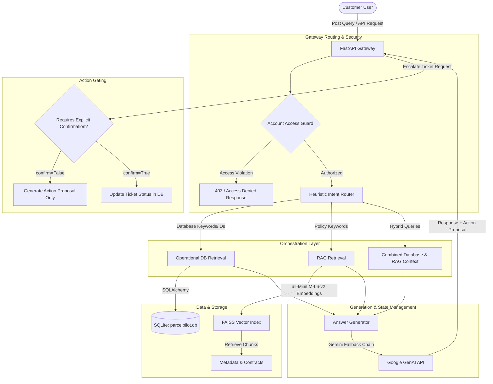

# CalQuity AI: Enterprise Multi-Tenant Customer Support Orchestrator

[](https://fastapi.tiangolo.com/)
[](https://nextjs.org/)
[](https://deepmind.google/technologies/gemini/)
[](https://github.com/facebookresearch/faiss)
[](#multi-tenant-security--isolation)

CalQuity AI is a production-grade, multi-tenant customer support AI assistant designed for the **ParcelPilot** logistics platform. It orchestrates real-time relational database queries (accounts, orders, and tickets) with a semantic search RAG (Retrieval-Augmented Generation) pipeline over customer contracts and global policies. 

Built with safety, scalability, and efficiency in mind, CalQuity AI ensures zero cross-tenant data leakage, handles destructive state-changes with a human-in-the-loop confirmation gate, and utilizes lazy-loading mechanisms to run efficiently on memory-constrained servers.

---

## 🏗️ System Architecture & Flow

The orchestrator dynamically routes and processes user queries through a multi-stage pipeline:



---

## 🚀 Key Features

### 🛡️ Multi-Tenant Security & Isolation
Cross-tenant data leakage is one of the most critical risks in enterprise AI systems. CalQuity AI enforces isolation at two distinct levels:
1. **Dynamic Query Interception**: The `AccountAccessGuard` interceptor scans user queries using regex and pattern matching to identify foreign account IDs (e.g., `ACCT-002` while authorized as `ACCT-001`) or competitor business names, instantly terminating unauthorized queries.
2. **Context Filtering**: When retrieving documents or relational database records, query results are filtered strictly against the authenticated `account_id`. RAG evidence prioritizing the account's custom contract is loaded first, supplemented only by *public* global policies.

### ⚡ Deterministic Intent Routing
To minimize latency and optimize LLM token consumption, incoming questions undergo heuristic routing:
* **DATABASE**: Queries looking up status, tracking information, carrier details, or ticket info mapped to pattern-matched IDs (`ORD-XXXX`, `TKT-XXXX`).
* **RAG**: Queries seeking clarity on cancellation rules, service level agreements (SLAs), refund policies, or company contract limits.
* **COMBINED**: Complex questions requiring structured database context (e.g., "Is my order ORD-1002 eligible for a refund under my contract?") which are fed both SQLite query output and RAG document chunks.

### 🔄 Human-in-the-Loop Action Gating
To prevent LLM hallucinations from directly invoking database mutations (e.g., writing status updates, deleting entries, or escalating tickets), the system uses a **Proposal -> Confirmation** lifecycle:
* When a user requests a state change (e.g., *"Please escalate ticket TKT-450"*), the `/query` endpoint returns a structured `ActionProposal` with `confirm=False` detailing what it intends to do.
* The frontend renders an explicit confirmation modal for the user.
* Upon user confirmation, a secure, state-changing POST request is sent to `/actions/escalate-ticket` with `confirm=True` to execute the transaction safely.

### 🦥 Resource-Optimized Lazy Loading
ML libraries like PyTorch, Transformers, and FAISS introduce significant overhead at boot time (often exceeding 1.5GB of RAM), causing server failures on lightweight hosting platforms (like Render's free tier). 
* CalQuity AI delays initialization of the SentenceTransformer encoder and the FAISS database index. They are instantiated only upon the **first incoming RAG query**.
* The FastAPI startup sequence completes in milliseconds, ensuring instant service health checks.

### 🔄 High-Availability Fallback Chain
We leverage the Google GenAI SDK to call Gemini models with a strict fallback chain to guarantee high availability:
$$\text{gemini-3.6-flash (Primary)} \longrightarrow \text{gemini-3.5-flash-lite} \longrightarrow \text{gemini-3.1-flash-lite}$$

---

## 🛠️ Technology Stack

| Component | Technology | Description |
| :--- | :--- | :--- |
| **Backend Framework** | [FastAPI](https://fastapi.tiangolo.com/) | High-performance ASGI Python web framework |
| **Database ORM** | [SQLAlchemy](https://www.sqlalchemy.org/) | Python SQL Toolkit and Object Relational Mapper |
| **Vector Engine** | [FAISS](https://github.com/facebookresearch/faiss) | Facebook AI Similarity Search for dense vector retrieval |
| **Embeddings Model** | `all-MiniLM-L6-v2` | SentenceTransformers model for generating 384-dimensional text embeddings |
| **LLM Gateway** | [Google GenAI SDK](https://github.com/googleapis/google-genai) | Gemini API Client supporting structured generation and fallback chains |
| **Frontend Framework** | [Next.js 16](https://nextjs.org/) | React 19 Server Components, App Router, TypeScript |
| **Styling** | [TailwindCSS v4](https://tailwindcss.com/) | Utility-first CSS engine for modern user interfaces |

---

## 📁 Repository Structure

```
CalQuity/
├── app/                        # FastAPI Backend Application
│   ├── agent/                  # Intent classification and routing heuristics
│   ├── api/                    # API routers, endpoints, and validation schemas
│   ├── database/               # SQLAlchemy models, connection engines, and repositories
│   ├── rag/                    # Document parsing, FAISS vector indexing, and generation
│   ├── services/               # Orchestration layers and security guards
│   └── main.py                 # FastAPI application definition
├── data/
│   ├── raw/                    # Source Excel datasets (accounts, orders, tickets) and PDF policies
│   └── processed/              # Generated SQLite databases and FAISS indexes
├── frontend/                   # Next.js 16 Client Dashboard
│   ├── app/                    # Next.js App Router and pages
│   ├── components/             # Reusable UI elements (Chat, Accounts, Order details)
│   └── package.json            # Node project configuration
├── scripts/                    # Database seeding, ingestion, and evaluation scripts
├── requirements.txt            # Python dependencies
└── main.py                     # Root service entrypoint
```

---

## ⚙️ Installation & Local Setup

### Prerequisites
* Python 3.11 or higher
* Node.js 18.x or higher
* A Gemini API Key from Google AI Studio

### 1. Clone & Set Up the Backend
Create a virtual environment, install python dependencies, and define environment variables:

```bash
# Create and activate virtual environment
python -m venv .venv
.venv\Scripts\activate      # On Windows
source .venv/bin/activate    # On macOS/Linux

# Install requirements
pip install -r requirements.txt
```

Create a `.env` file in the root directory:
```env
GEMINI_API_KEY=your_gemini_api_key_here
```

### 2. Seed Database and Vector Store
Extract and load the master records from Excel into the SQLite database and embed policy PDFs into FAISS:

```bash
# Seed operational tables (accounts, orders, tickets)
python -m scripts.import_excel

# Verify database integrity and relationships
python -m scripts.test_database
```

### 3. Run the Backend API
Start the FastAPI server via Uvicorn:

```bash
python -m uvicorn main:app --reload --port 8000
```
The API docs will be available at [http://127.0.0.1:8000/docs](http://127.0.0.1:8000/docs).

### 4. Set Up the Frontend Next.js Client
In a separate terminal window:

```bash
cd frontend

# Install Node modules
npm install

# Run in development mode
npm run dev
```
Open [http://localhost:3000](http://localhost:3000) to access the customer support agent chat interface.

---

## 🧪 Testing & Validation

A suite of verification scripts are provided under `scripts/` to validate each layer of the architecture independently:

* **Intent Routing Test**: `python -m scripts.test_router`
* **Access Control Check**: Run `python -m scripts.test_query_service` to verify that cross-tenant queries raise explicit `AccountAccessError` exceptions.
* **Vector Retriever Evaluation**: `python -m scripts.test_retrieval`
* **Gemini Pipeline Check**: `python -m scripts.test_gemini` and `python -m scripts.test_generator`

---

## 🔒 Security Best Practices Implemented

> [!IMPORTANT]
> **Strict Tenant Context Mapping**
> Under no circumstances does the query interface allow executing requests without an `account_id`. Standard API endpoints require an explicit authorization parameter to bind execution to a single tenant context.

> [!WARNING]
> **Write Action Sanitization**
> No state-changing endpoints (e.g. status changes, updates, or deletions) permit query injections. Values are parsed, validated, and explicitly updated using SQLAlchemy transaction parameters rather than dynamic SQL strings.
